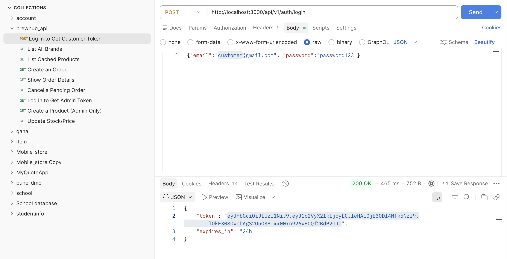

# BrewHub API 🚀

BrewHub is a production-grade, optimized backend RESTful API designed for the beverage industry. It empowers beverage brands to manage their digital product catalogs while allowing authenticated customers to browse inventories, apply filters with dynamically cached responses, and securely place orders under strict concurrency safety guidelines.

Built using **Ruby on Rails (API-only mode)**, PostgreSQL, Redis, and Sidekiq.

---

## 🏗️ Core Architecture & Features

### 1. Robust JWT Authentication (Zero Devise)
* Custom security infrastructure built entirely from scratch using the native `jwt` and `bcrypt` gems.
* Requests to protected resources require an `Authorization: Bearer <token>` header.
* Fine-grained, role-based authorization ensuring customers can only access their personal orders, while blocking catalog writes with a strict `403 Forbidden` for non-administrative roles.

### 2. High-Performance Query Optimizations
* **GET /api/v1/brands**: Resolves the full listing of brands alongside their respective product counts in **exactly one SQL query** to combat $N+1$ performance degradation. Optimized via a transactional `left_joins + group + select` routine.
* **GET /api/v1/orders/:id**: Utilizes an Eager Loading scheme (`includes(order_items: :product)`) to snap line items and product metadata in a single nested lookup, keeping database roundtrips completely flat.

### 3. Database Race-Condition Protections
* **Pessimistic Row Locking**: Inventory adjustments during checkout (`POST /api/v1/orders`) utilize an explicit `Product.lock.find` (`SELECT ... FOR UPDATE`) mechanism inside an atomic database transaction block. This guarantees stock consistency and isolates inventory allocations against high-concurrency race conditions.

### 4. Advanced Multi-Key Caching (Redis)
* The catalog endpoint (`GET /api/v1/products`) dynamically hashes search query arrays (e.g., `category`, `in_stock`) using an MD5 digest wrapper to partition and cache distinct query filters independently.
* Configured with a **15-minute Time-To-Live (TTL)** and a transactional `after_commit` model hook to invalidate the local cache partition immediately upon product updates or creations.

### 5. Dedicated Background Workers
* Low-stock events trigger an asynchronous pipeline managed via **Sidekiq** running on a isolated `alerts` processing queue.
* Built-in resiliency backing up critical alerts via a 3-tier exponential back-off strategy.

---

## 📁 API Collection Verification

Below is the verified API request suite configuration executed within Postman, covering authentication, catalog indexing, and transactional order dispatching.



---

## 🛠️ Getting Started Locally

### Prerequisites
Ensure you have the following installed on your machine:
* Ruby 3.x+
* PostgreSQL
* Redis (for Caching & Sidekiq background processing)

### Installation Steps

1. **Clone the repository**
   ```bash
   git clone <your-github-repo-link>
   cd brewhub_api